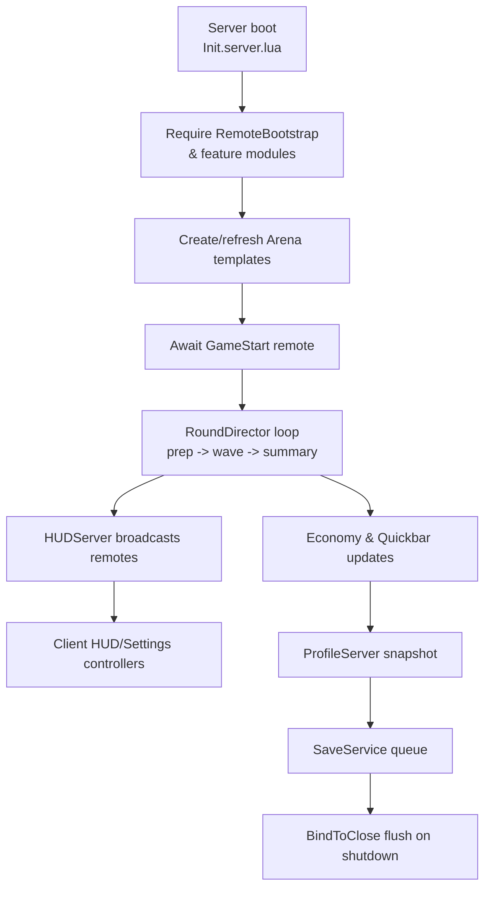
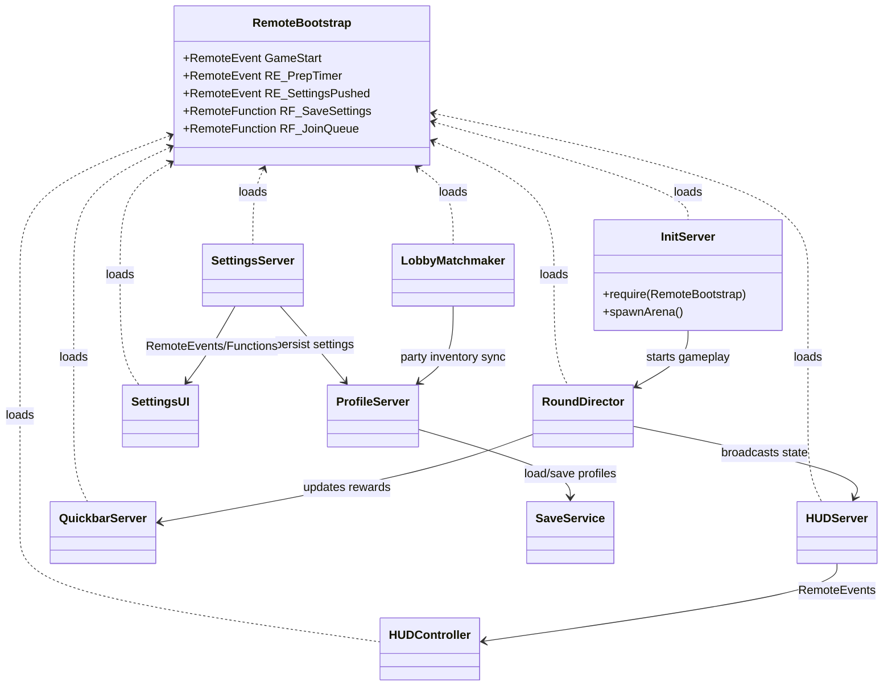

# Architecture

_Content to be migrated._
# Fruit Smash Architecture Overview

This document pairs the module dependency graph from Task 11 with a code-level review of the Roblox experience to explain how the pieces operate together. It highlights the responsibilities of each layer, how data flows from startup through shutdown, and how remotes carry state between server and client.

## Repository structure at a glance
- **Shared configuration & systems (`ReplicatedStorage/Shared`)** &mdash; central tunables, localization helpers, and content loaders that are shared by both server and client runtimes.【F:ReplicatedStorage/Shared/Config/GameConfig.lua†L1-L160】【F:ReplicatedStorage/Shared/Systems/Localizer.lua†L3-L156】【F:ReplicatedStorage/Shared/Content/ContentRegistry.lua†L1-L160】
- **Networking surface (`ReplicatedStorage/Remotes`)** &mdash; a single bootstrap module that creates and exports every RemoteEvent/RemoteFunction used by the experience so all call sites share stable references.【F:ReplicatedStorage/Remotes/RemoteBootstrap.lua†L1-L110】
- **Server runtime (`ServerScriptService`)** &mdash; bootstrap, round orchestration, matchmaking, data, and feature-specific services. Modules require shared config and remotes at load time to stay synchronized.【F:ServerScriptService/GameServer/Init.server.lua†L1-L123】【F:ServerScriptService/GameServer/RoundDirectorServer.lua†L592-L599】【F:ServerScriptService/GameServer/QuickbarServer.lua†L1-L141】【F:ServerScriptService/Match/LobbyMatchmaker.server.lua†L960-L1000】
- **Persistence layer (`ServerScriptService/Data`)** &mdash; profile management plus a SaveService facade over DataStore with studio-safe fallbacks and BindToClose flushing.【F:ServerScriptService/Data/SaveService.lua†L313-L382】【F:ServerScriptService/Data/SaveService.lua†L540-L567】【F:ServerScriptService/Data/ProfileServer.lua†L1300-L1399】
- **Client controllers (`StarterPlayer/StarterPlayerScripts`)** &mdash; UI and gameplay controllers that hydrate from remotes and shared config to render HUD, settings, tutorial, and other interactive experiences.【F:StarterPlayer/StarterPlayerScripts/Controllers/HUDController.client.lua†L3-L40】【F:StarterPlayer/StarterPlayerScripts/Controllers/SettingsUI.client.lua†L11-L30】

## Core components and responsibilities

### Shared systems
- **GameConfig** centralizes gameplay, economy, and accessibility tunables so both server logic (e.g., Quickbar and round pacing) and UI surfaces read from one place.【F:ReplicatedStorage/Shared/Config/GameConfig.lua†L1-L160】【F:ServerScriptService/GameServer/QuickbarServer.lua†L19-L52】
- **Localizer** normalizes locale IDs, renders string templates, and exposes helpers for both server pushes (e.g., notifications) and client UI copies.【F:ReplicatedStorage/Shared/Systems/Localizer.lua†L3-L156】
- **ContentRegistry** resolves arena templates and other assets by ID, bridging ServerStorage and ReplicatedStorage while warning when assets are missing to keep gameplay builders decoupled from raw instances.【F:ReplicatedStorage/Shared/Content/ContentRegistry.lua†L1-L160】【F:ServerScriptService/GameServer/ArenaServer.lua†L1-L64】

### Networking surface
- **RemoteBootstrap** guarantees that required RemoteEvents and RemoteFunctions exist (creating them on demand) and freezes a table of references consumed across the codebase. It spans gameplay flow (`GameStart`), HUD telemetry (`RE_PrepTimer`, `RE_TargetHP`), economy (`RE_CoinPointDelta`), matchmaking (`RF_JoinQueue`), persistence (`RF_SaveSettings`), tutorial flow, and more, reflecting the hubs surfaced in the dependency graph.【F:ReplicatedStorage/Remotes/RemoteBootstrap.lua†L1-L110】

### Server runtime services
- **Init.server.lua** is the entry point that loads remote definitions, requires key feature modules (settings, tutorial, shop, combat), creates the arenas workspace folder, and listens for `GameStart` to clone an arena template. This stage wires the core services surfaced as root nodes in the dependency graph.【F:ServerScriptService/GameServer/Init.server.lua†L1-L123】
- **RoundDirectorServer** orchestrates the lifecycle of matches by pulling telemetry, broadcasting wave changes to the HUD layer, issuing prep timers, and coordinating with supporting systems (economy payouts, turret controllers, obstacles).【F:ServerScriptService/GameServer/RoundDirectorServer.lua†L3-L1078】
- **HUDServer** sanitizes payloads and publishes prep timers, wave changes, target health, and coin deltas over the shared remotes so clients can render authoritative state.【F:ServerScriptService/GameServer/HUDServer.lua†L193-L238】
- **QuickbarServer** builds authoritative quickbar snapshots using shop and game config, honours feature flags, and pushes updates through remotes when inventory changes.【F:ServerScriptService/GameServer/QuickbarServer.lua†L1-L141】
- **SettingsServer** handles accessibility settings: it responds to `RF_SaveSettings`, mirrors settings via attributes and the `RE_SettingsPushed` remote, and persists choices back into profiles.【F:ServerScriptService/GameServer/SettingsServer.lua†L10-L20】【F:ServerScriptService/GameServer/SettingsServer.lua†L320-L341】【F:ServerScriptService/GameServer/SettingsServer.lua†L392-L420】
- **Matchmaking (LobbyMatchmaker)** exposes `RF_JoinQueue`/`RF_LeaveQueue` handlers, manages party state, and coordinates teleport lifecycle around match transitions.【F:ServerScriptService/Match/LobbyMatchmaker.server.lua†L960-L1000】

### Persistence and profile management
- **SaveService** wraps DataStore access with retries, cooldowns, checkpoint providers, and a BindToClose flush to preserve player profiles even during shutdown.【F:ServerScriptService/Data/SaveService.lua†L313-L382】【F:ServerScriptService/Data/SaveService.lua†L540-L567】
- **ProfileServer** bootstraps default inventories, loads serialized saves asynchronously, updates them on PlayerRemoving, and registers checkpoints so BindToClose flushes the latest state.【F:ServerScriptService/Data/ProfileServer.lua†L1300-L1399】

### Client controllers
- **HUDController** requires `RemoteBootstrap`, subscribes to prep, wave, target HP, and coin delta remotes, and renders the in-game HUD with animations and accessibility palettes.【F:StarterPlayer/StarterPlayerScripts/Controllers/HUDController.client.lua†L3-L79】
- **SettingsUI** mirrors the server-side settings model by reading shared config, calling `RF_SaveSettings`, listening for `RE_SettingsPushed`, and optionally syncing tutorial progress via `RF_Tutorial`.【F:StarterPlayer/StarterPlayerScripts/Controllers/SettingsUI.client.lua†L11-L30】

## Data flow & lifecycle

The runtime follows a predictable lifecycle from bootstrap through cleanup. The flowchart summarizes the interactions, while the narrative ties back to the dependency graph hubs.

- **Initialization** &mdash; `Init.server.lua` requires the remote table, settings/tutorial/shop modules, ensures the arena template exists, and hooks the `GameStart` RemoteEvent so player input can spawn live arenas.【F:ServerScriptService/GameServer/Init.server.lua†L1-L123】
- **Player session start** &mdash; when players join, `ProfileServer` creates default data, loads serialized saves through `SaveService`, refreshes quickbar state, and registers checkpoints that the persistence layer can flush later.【F:ServerScriptService/Data/ProfileServer.lua†L1300-L1399】【F:ServerScriptService/Data/SaveService.lua†L313-L382】
- **Runtime loop** &mdash; `RoundDirectorServer` drives the prep/wave/summary state machine, calls into `HUDServer` to broadcast authoritative state, and coordinates with economy/quickbar subsystems to reward players and update inventories.【F:ServerScriptService/GameServer/RoundDirectorServer.lua†L592-L599】【F:ServerScriptService/GameServer/RoundDirectorServer.lua†L1062-L1067】【F:ServerScriptService/GameServer/HUDServer.lua†L193-L238】【F:ServerScriptService/GameServer/QuickbarServer.lua†L1-L141】
- **Client updates** &mdash; HUD and settings controllers require the same remote table, listen for state pushes (`RE_PrepTimer`, `RE_SettingsPushed`, etc.), and surface the information through UI transitions and accessibility-aware layouts.【F:StarterPlayer/StarterPlayerScripts/Controllers/HUDController.client.lua†L3-L40】【F:StarterPlayer/StarterPlayerScripts/Controllers/SettingsUI.client.lua†L14-L30】
- **Shutdown** &mdash; `SaveService` binds to close, flushes queued saves, and leverages registered checkpoints so any in-flight profile data is persisted before the server exits.【F:ServerScriptService/Data/SaveService.lua†L540-L567】

## Event and remote patterns

RemoteBootstrap acts as the single source of truth for cross-boundary communication, and the dependency graph clusters reveal how each subsystem consumes those bindings:

- **Server publishers**
  - `HUDServer` fires prep timers, wave changes, and target health over dedicated remotes after sanitizing payloads.【F:ServerScriptService/GameServer/HUDServer.lua†L193-L238】
  - `SettingsServer` pushes accessibility settings to individual clients via `RE_SettingsPushed` and services client mutations through `RF_SaveSettings`.【F:ServerScriptService/GameServer/SettingsServer.lua†L320-L341】【F:ServerScriptService/GameServer/SettingsServer.lua†L392-L420】
  - `RoundDirectorServer` and economy modules call into those publishers, keeping gameplay flow authoritative while allowing UI modules to stay lean.【F:ServerScriptService/GameServer/RoundDirectorServer.lua†L592-L599】【F:ServerScriptService/GameServer/RoundDirectorServer.lua†L1062-L1067】
  - `LobbyMatchmaker` uses `RF_JoinQueue`/`RF_LeaveQueue` as request-response channels for queue membership, ensuring only one authoritative path edits party state.【F:ServerScriptService/Match/LobbyMatchmaker.server.lua†L960-L1000】

- **Client subscribers**
  - Controllers require `RemoteBootstrap` to obtain the same references the server used, avoiding name-based lookups at runtime.【F:StarterPlayer/StarterPlayerScripts/Controllers/HUDController.client.lua†L15-L40】【F:StarterPlayer/StarterPlayerScripts/Controllers/SettingsUI.client.lua†L14-L30】
  - HUD and settings layers interpret payloads from their respective remotes to drive UI, mirroring the shared GameConfig to stay consistent with server-calculated ranges and palettes.【F:StarterPlayer/StarterPlayerScripts/Controllers/HUDController.client.lua†L37-L79】【F:StarterPlayer/StarterPlayerScripts/Controllers/SettingsUI.client.lua†L19-L30】

- **Bi-directional flows**
  - Settings, tutorial progress, queue membership, purchases, and token usage all use RemoteFunctions defined in `RemoteBootstrap`, keeping client-driven actions serialized through a vetted server handler.【F:ReplicatedStorage/Remotes/RemoteBootstrap.lua†L39-L104】【F:ServerScriptService/GameServer/SettingsServer.lua†L392-L420】【F:ServerScriptService/Match/LobbyMatchmaker.server.lua†L960-L1000】

## Component relationships

The following diagram extracts the most connected nodes from the Task 11 dependency graph and summarizes how the major modules collaborate at runtime.

Together, these relationships show how the shared remote layer anchors both the server- and client-side modules, while persistence services close the loop between gameplay state and long-term progression.
