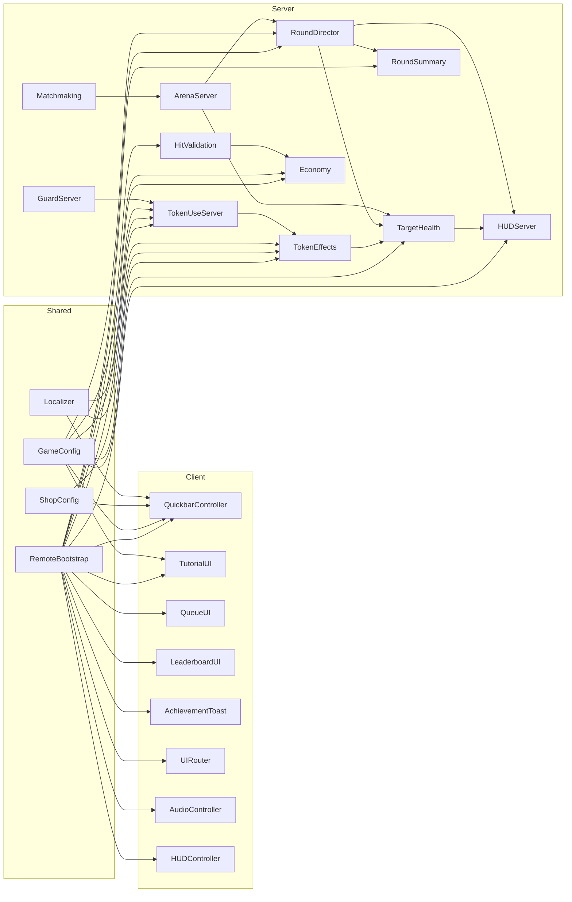

# Dependency Map

The machine-readable manifest that backs this overview lives in `manifest/dependencies.json` and enumerates each module, its layer, and the remotes/config it touches.【F:manifest/dependencies.json†L1-L1321】 The sections below call out the most critical relationships for engineers reviewing or extending gameplay systems.

## High-level graph

## Shared services

* **RemoteBootstrap** instantiates the canonical set of RemoteEvents/RemoteFunctions shared by the client controllers and server handlers, including combat, economy, matchmaking, and leaderboard channels.【F:ReplicatedStorage/Remotes/RemoteBootstrap.lua†L9-L105】
* **GameConfig**, **ShopConfig**, and **Localizer** modules sit in `ReplicatedStorage/Shared` so both client and server code can pull tuning, catalog data, and localization helpers; their roles and dependents are cataloged in the manifest.【F:manifest/dependencies.json†L63-L119】【F:manifest/dependencies.json†L1127-L1184】【F:manifest/dependencies.json†L1203-L1269】

## Client controllers

* `QuickbarController.client.lua` consumes GameConfig, ShopConfig, Localizer, and the quickbar/token remotes to build the HUD and fire token usage requests.【F:StarterPlayer/StarterPlayerScripts/Controllers/QuickbarController.client.lua†L13-L68】
* `TutorialUI.client.lua` gates the onboarding flow by reading GameConfig for obstacle unlock levels and invoking `RF_Tutorial` to fetch/save completion state.【F:StarterPlayer/StarterPlayerScripts/Controllers/TutorialUI.client.lua†L14-L55】
* `QueueUI.client.lua` listens for `PartyUpdate` events to render matchmaking status and countdowns.【F:StarterPlayer/StarterPlayerScripts/Controllers/QueueUI.client.lua†L33-L50】
* `LeaderboardUI.client.lua` streams session updates via `RE_SessionLeaderboard` and polls `RF_GetGlobalLeaderboard` on demand.【F:StarterPlayer/StarterPlayerScripts/Controllers/LeaderboardUI.client.lua†L14-L18】
* `AchievementToast.client.lua` subscribes to `RE_AchievementToast` and renders transient toast notifications in the player HUD.【F:StarterPlayer/StarterPlayerScripts/Controllers/AchievementToast.client.lua†L22-L29】
* `UIRouter.client.lua` watches `RE_PrepTimer`, `RE_WaveChanged`, and `RE_Notice` to drive high-level UI state transitions across the client HUD.【F:StarterPlayer/StarterPlayerScripts/Controllers/UIRouter.client.lua†L157-L198】
* `AudioController.client.lua` bridges RemoteBootstrap and AudioBus so lane/level events trigger the appropriate sound cues.【F:StarterPlayer/StarterPlayerScripts/Controllers/AudioController.client.lua†L5-L31】

## Server systems

* `RoundDirectorServer.lua` orchestrates the arena lifecycle, requiring HUDServer, ArenaServer, TargetHealthServer, and RoundSummaryServer while optionally wiring in telemetry, match-return, obstacles, and economy services.【F:ServerScriptService/GameServer/RoundDirectorServer.lua†L3-L126】
* `RoundSummaryServer.lua` aggregates per-level stats and publishes the `RE_RoundSummary` payloads consumed by the lobby and client UI.【F:ServerScriptService/GameServer/RoundSummaryServer.lua†L7-L24】
* `TargetHealthServer.lua` keeps authoritative lane health, calls into TargetImmunity/Achievement hooks, and forwards updates through HUDServer.【F:ServerScriptService/GameServer/TargetHealthServer.lua†L1-L55】
* `TokenEffectsServer.lua` executes token payloads with localization, ShopConfig/GameConfig tuning, telemetry, and optional RemoteBootstrap lookups for notices.【F:ServerScriptService/GameServer/TokenEffectsServer.lua†L9-L120】
* `TokenUseServer.server.lua` guards `RF_UseToken` invocations, respects the Tokens feature flag, and delegates to TokenEffects and RoundSummary modules.【F:ServerScriptService/GameServer/TokenUseServer.server.lua†L10-L67】
* `HitValidationServer.lua` validates melee swings against GameConfig/FruitConfig, rate-limits via Guard, and posts economy deltas through the shared remotes.【F:ServerScriptService/Combat/HitValidationServer.lua†L7-L31】
* `EconomyServer.lua` (GameServer scope) pulls GameConfig/FruitConfig, resolves ArenaServer lazily, and fires `RE_CoinPointDelta` for reward updates.【F:ServerScriptService/GameServer/Economy/EconomyServer.lua†L1-L83】
* `HUDServer.lua` sanitizes timer, wave, and target HP payloads before firing HUD-related RemoteEvents.【F:ServerScriptService/GameServer/HUDServer.lua†L5-L13】
* `ArenaAdapter.lua`, `ProjectileServer.lua`, and `TargetImmunityServer.lua` supply combat utilities used by RoundDirector, TokenEffects, and target health logic to apply shield states and resolve projectile hits.【F:ServerScriptService/Combat/ArenaAdapter.lua†L1-L9】【F:ServerScriptService/Combat/ProjectileServer.lua†L5-L18】【F:ServerScriptService/GameServer/TargetImmunityServer.lua†L1-L37】
* `MatchmakingServer.lua` works with ArenaServer to form parties and spawn arenas when groups are ready.【F:ServerScriptService/GameServer/MatchmakingServer.lua†L1-L31】

## Tooling & QA remotes

* `AdminPanel.client.lua` invokes `RF_QAAdminCommand`, which is provisioned server-side by `Tools/AdminCommands.server.lua` and backed by GuardServer plus numerous game systems for debugging workflows.【F:StarterPlayer/StarterPlayerScripts/AdminPanel.client.lua†L24-L41】【F:ServerScriptService/Tools/AdminCommands.server.lua†L8-L33】

## External dependencies

* Persistent profile storage is optional; `GameServer/Data/PersistenceServer.lua` locates and requires `ProfileService` if present across several candidate locations, otherwise it logs a warning and falls back to session-only data.【F:ServerScriptService/GameServer/Data/PersistenceServer.lua†L82-L110】
# Dependencies

Fruit Smash leans on a small set of development tools and Roblox platform services. Use this list to verify your environment before running or deploying the experience.

## Development tooling
- **Rojo CLI 7.4+** – Required for live-sync (`rojo serve`) and building place files; a Windows binary is bundled as `rojo.exe` for convenience.【F:docs/SETUP.md†L7-L24】
- **Git** – Source control for all Luau, asset, and marketing files.
- **Luau-aware editor (VS Code + extensions, IDEA, etc.)** – Recommended for diagnostics but not required.【F:docs/SETUP.md†L7-L14】

## Core Roblox services
- **DataStoreService** – `SaveService` persists player profiles with retries and studio fallbacks; enable API services when testing in Studio.【F:ServerScriptService/Data/SaveService.lua†L1-L40】【F:docs/SETUP.md†L15-L26】
- **ServerStorage** – Arena templates are cloned from `ServerStorage/ArenaTemplates/BaseArena` during bootstrap, so the folder must be available when the server starts.【F:ServerScriptService/GameServer/Init.server.lua†L93-L123】【F:ServerStorage/ArenaTemplates/BaseArena/init.lua†L1-L72】
- **HttpService** – Used for GUID generation and analytics payload preparation in arena management and telemetry modules.【F:ServerScriptService/GameServer/ArenaServer.lua†L1-L38】【F:ServerScriptService/Analytics/TelemetryServer.lua†L1-L40】
- **TeleportService** – Lobby matchmaking relies on reserved servers and teleporting parties into match instances when remote places are configured.【F:ServerScriptService/Match/LobbyMatchmaker.server.lua†L1-L20】【F:ServerScriptService/Match/LobbyMatchmaker.server.lua†L825-L856】
- **StatsService & Diagnostics** – Developer tooling such as `PerfHarness.server.lua` reads frame timing and counts workspace instances to surface health warnings.【F:ServerScriptService/Tools/PerfHarness.server.lua†L1-L34】

## Shared modules and configuration
- **Content registry** – `ReplicatedStorage/Shared/Content/ContentRegistry.lua` resolves assets lazily and expects shared content folders to be populated; optional server-only assets can live in `ServerStorage`.【F:ReplicatedStorage/Shared/Content/ContentRegistry.lua†L1-L80】
- **Feature flags** – `Shared/Config/Flags.lua` toggles telemetry, achievements, obstacles, and other subsystems. Modules such as telemetry and achievements read these flags at runtime, so keep the configuration in sync with live expectations.【F:ServerScriptService/Analytics/TelemetryServer.lua†L29-L44】【F:ServerScriptService/GameServer/AchievementServer.lua†L12-L37】
- **Save schema & configs** – Shared defaults in `Shared/Types/SaveSchema.lua` and `Shared/Config/GameConfig.lua` must load before profile and settings services initialize.【F:ServerScriptService/Data/ProfileServer.lua†L1-L68】【F:ReplicatedStorage/Shared/Config/GameConfig.lua†L1-L68】

## Optional integrations
- **Telemetry sinks** – `Analytics/TelemetryServer.lua` exposes a sink registration system; populate sinks when wiring external analytics providers. The module safely no-ops if telemetry is disabled via flags.【F:ServerScriptService/Analytics/TelemetryServer.lua†L1-L88】
- **Guard moderation hooks** – `Moderation/GuardServer.lua` backs remote rate limiting and exploit heuristics. Shop, token, and combat remotes already wrap through it, but you can extend guard thresholds or telemetry event names as needed.【F:ServerScriptService/Tools/AdminCommands.server.lua†L1-L34】【F:ServerScriptService/Moderation/GuardServer.lua†L810-L846】

