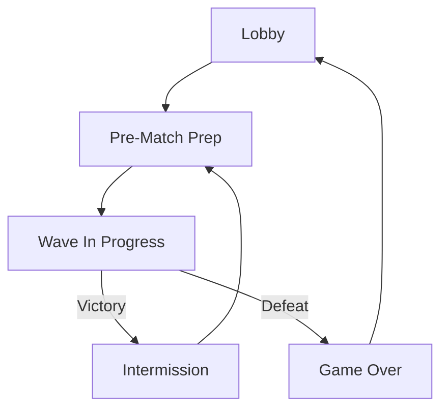
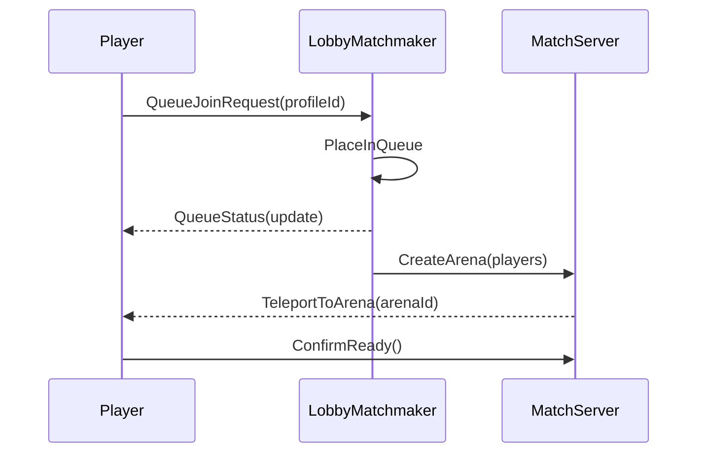
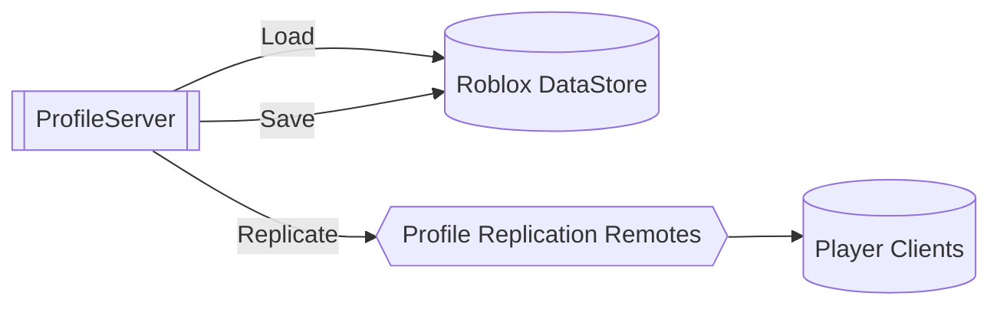

# FruitSmash Systems Overview

This document tracks the high-level flows that tie the major gameplay services together.  Each diagram is authored in Mermaid so it can be validated and, when tooling is available, exported as an image for slide decks or wikis.  Run `python tools/mermaid_render.py` from the repository root to lint these diagrams and produce SVG exports in `docs/assets/diagrams/`.

## Match Lifecycle Flow

The flow mirrors the UI router in `StarterPlayer/StarterPlayerScripts/Controllers/UIRouter.client.lua` and the server match coordination scripts under `ServerScriptService/Match/`.

## Matchmaking Sequence

This diagram outlines the interplay between the lobby matchmaker (`ServerScriptService/Match/LobbyMatchmaker.server.lua`) and the arena host scripts that live under `ServerScriptService/Match/`.

## Profile Persistence Overview

`ServerScriptService/Data/ProfileServer.lua` coordinates persistent data round-trips.  Clients read their profile state through the replicated remotes after the server finishes loading from the Roblox DataStore layer.
# Architecture Overview

FruitSmash splits gameplay concerns between Roblox services while keeping reusable modules in `ReplicatedStorage/Shared`.

## Service Layout

- **ServerScriptService** holds authoritative systems:
  - [`GameServer`](../ServerScriptService/GameServer) orchestrates session state machines.
  - [`Match`](../ServerScriptService/Match) coordinates matchmaking, arena swaps, and post-match payouts.
  - [`Data`](../ServerScriptService/Data) provides persistence services such as [`ProfileServer.lua`](../ServerScriptService/Data/ProfileServer.lua).
- **StarterPlayer** ships client controllers and UI routers under [`StarterPlayerScripts`](../StarterPlayer/StarterPlayerScripts).
- **ReplicatedStorage** exposes shared modules and remote definitions for both ends of the experience.

## Sync Pipeline

Rojo (`rojo.exe`) consumes [`default.project.json`](../default.project.json) to map the repository tree into a Roblox place file. Run `rojo build` to produce an updated `.rbxl` or `rojo serve` to hot reload from the repo.

1. Update source under `ServerScriptService`, `StarterPlayer`, or `ReplicatedStorage`.
2. Execute `rojo serve --port 34872` and connect from Roblox Studio.
3. Publish changes through Studio once QA signs off.

> Tip: use the [UI reference](./ui-guide.md#hud-systems) to confirm the lobby + match HUD states during QA passes.

## Shared Modules

Shared gameplay math and constants live in [`ReplicatedStorage/Shared`](../ReplicatedStorage/Shared). Modules are consumed by both server and client controllers. For example:

- `Systems/RNG.lua` centralizes deterministic randomization for loot and power-ups.
- `Systems/WeightedTable.lua` helps build weighted reward selections consumed by [`EconomyServer.lua`](../ServerScriptService/Economy/EconomyServer.lua).
- `Config/FruitConfig.lua` synchronizes fruit scoring, spawn rates, and icon metadata across server and client scripts.

See [gameplay.md](./gameplay.md#reward-payouts) for how these modules plug into rewards and payouts.
