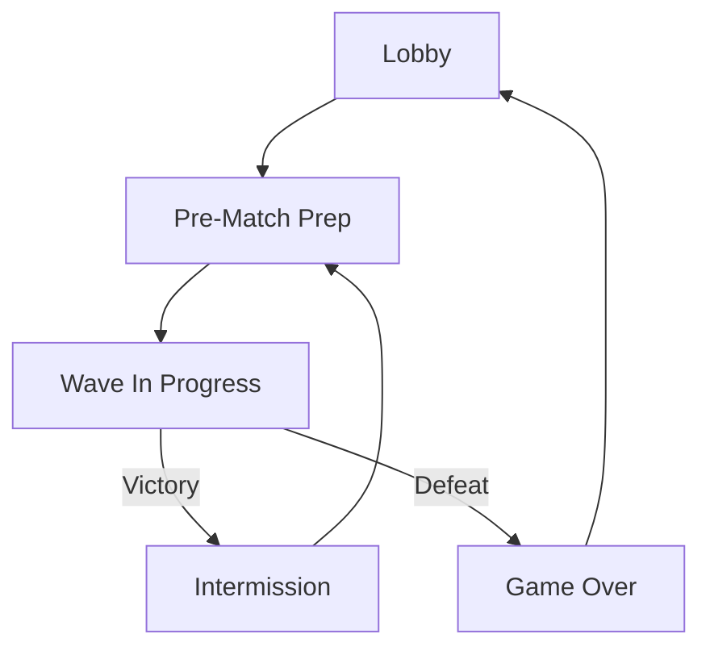
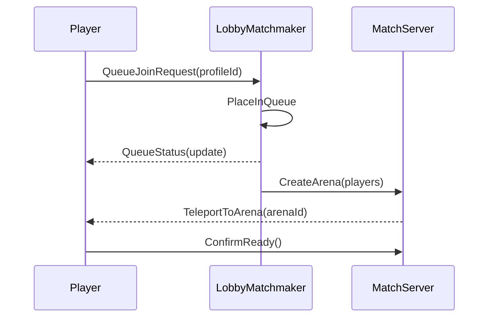
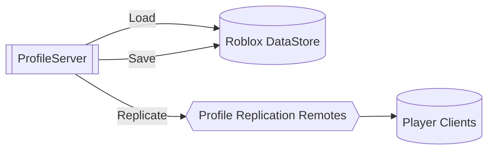

# FruitSmash Systems Overview

This document tracks the high-level flows that tie the major gameplay services together.  Each diagram is authored in Mermaid so it can be validated and, when tooling is available, exported as an image for slide decks or wikis.  Run `python tools/mermaid_render.py` from the repository root to lint these diagrams and produce SVG exports in `docs/assets/diagrams/`.

## Match Lifecycle Flow

The flow mirrors the UI router in `StarterPlayer/StarterPlayerScripts/Controllers/UIRouter.client.lua` and the server match coordination scripts under `ServerScriptService/Match/`.

## Matchmaking Sequence

This diagram outlines the interplay between the lobby matchmaker (`ServerScriptService/Match/LobbyMatchmaker.server.lua`) and the arena host scripts that live under `ServerScriptService/Match/`.

## Profile Persistence Overview

`ServerScriptService/Data/ProfileServer.lua` coordinates persistent data round-trips.  Clients read their profile state through the replicated remotes after the server finishes loading from the Roblox DataStore layer.
